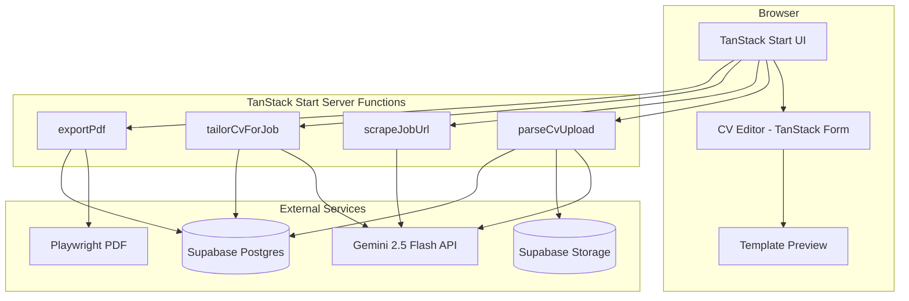
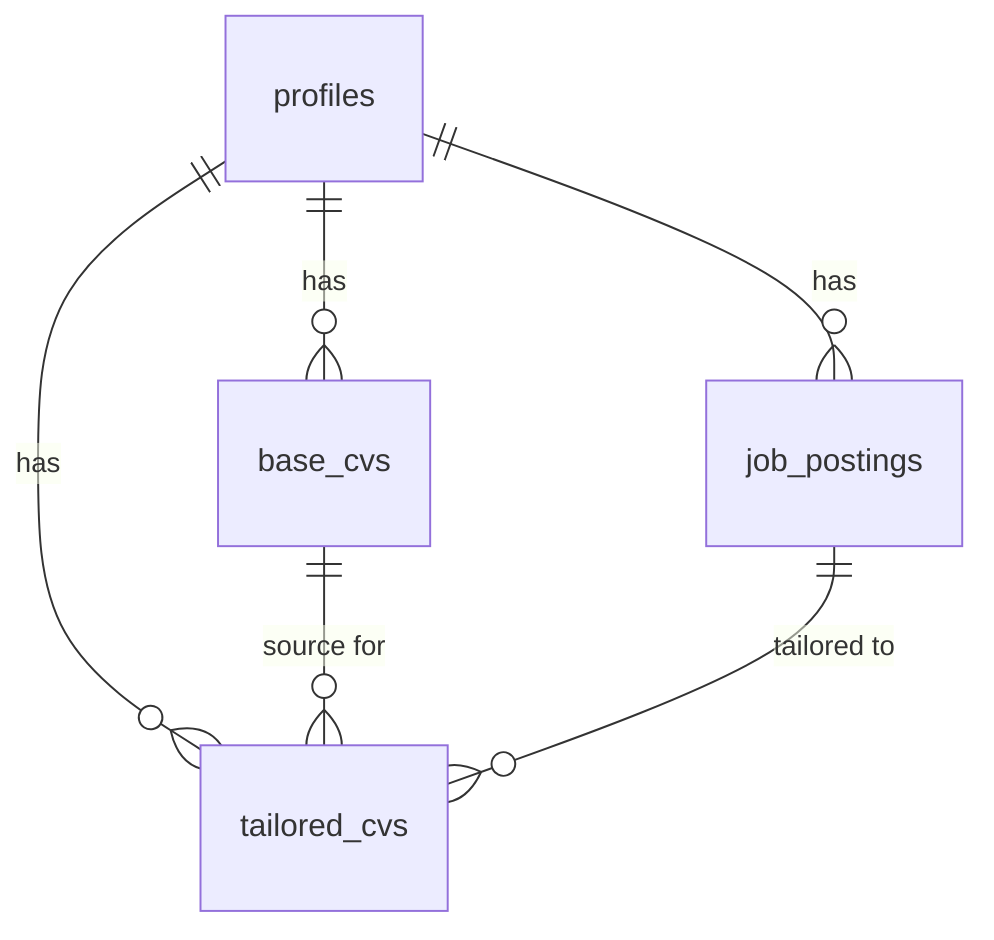
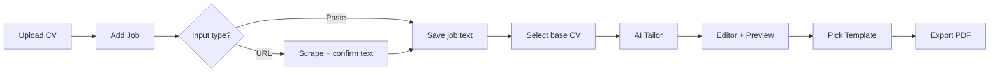

# AI Resume Builder — Design Spec

**Date:** 2026-06-14  
**Status:** Approved  
**Phase:** MVP (v1)

## Summary

A web application that uses Gemini 2.5 Flash to tailor CVs against job descriptions. Users upload an existing CV (PDF/Word), provide a job description via paste or URL, AI tailors the content, user edits inline, picks a template, and exports a PDF.

Built for single-user local use now, with architecture ready for multi-user deployment later.

## Requirements (v1)

| Decision | Choice |
|----------|--------|
| Audience | Single user now; multi-user later |
| MVP scope | Core loop only (no tracker, no job research) |
| Base CV input | Upload PDF or Word; AI extracts and structures |
| Job input | Paste text **and** URL (with scrape + confirm) |
| Manual editing | Full inline editor (bullets, sections, reorder) |
| Deployment | Local now; deploy-ready architecture |
| Framework | TanStack Start |
| Data & files | Supabase (Postgres + Storage) |
| AI | Gemini 2.5 Flash |
| Templates | 4 (Classic, Modern, Creative, Compact) |
| Export format | PDF only |

### Deferred to later phases

- User authentication / multi-user
- Application tracker (Kanban per company)
- Job market research / job suggestions
- DOCX export
- Version history / diff between tailored CVs

---

## Architectural Approaches Considered

### Approach 1: HTML templates + Playwright PDF ✅ Selected

React components render CV templates in the browser for live preview. Export uses a TanStack Start server function that feeds the same HTML to Playwright and returns a PDF.

**Pros:** WYSIWYG preview matches export; full CSS for 4 distinct templates; professional PDF quality.  
**Cons:** Playwright is heavy (~300MB); awkward on some serverless hosts (fine on Railway/Docker).

### Approach 2: `@react-pdf/renderer` templates

Templates built with react-pdf primitives; preview and export use the same library.

**Pros:** Lightweight, serverless-friendly; fast export.  
**Cons:** Limited styling; harder to achieve creative layouts.

### Approach 3: Client-side PDF (`html2canvas` + `jsPDF`)

Browser captures the preview DOM and downloads a PDF.

**Pros:** Zero server PDF infra; works offline.  
**Cons:** Poor pagination and print quality; inconsistent across browsers.

---

## §1 Architecture



### Stack

| Layer | Choice |
|-------|--------|
| Framework | TanStack Start (RC) + TanStack Router |
| Data fetching | TanStack Query |
| Forms / editor | TanStack Form |
| Database | Supabase Postgres |
| File storage | Supabase Storage |
| AI | Gemini 2.5 Flash (structured JSON output) |
| PDF | Playwright (headless Chromium) |
| Styling | Tailwind CSS + shadcn/ui |

### Key flows

1. **Upload CV** → file to Supabase Storage → server extracts text (`pdf-parse` / `mammoth`) → Gemini structures into JSON schema → saved as `base_cv`
2. **Job input** → paste text directly, or URL → server fetches HTML → Readability extracts text → Gemini cleans/validates → user confirms text → saved as `job_posting`
3. **Tailor** → Gemini takes `base_cv` JSON + `job_posting` → returns tailored JSON (reordered skills, rewritten bullets, keyword alignment) → opens in editor
4. **Edit** → TanStack Form inline editor (sections, bullets, drag-reorder)
5. **Export** → pick template → Playwright renders HTML → PDF download

### Single-user now, multi-user later

- No auth in v1 — implicit single `profile` row
- All tables include `profile_id` from day one
- Supabase RLS policies stubbed but disabled until auth is added
- `DEFAULT_PROFILE_ID` env var identifies the seed profile

### Deploy-ready

- Secrets in `.env` (`GEMINI_API_KEY`, `SUPABASE_URL`, `SUPABASE_SERVICE_ROLE_KEY`) — never `VITE_` prefixed
- `npm run dev` locally; deploy later to Railway/Vercel with the same env vars
- TanStack Start server functions access DB, AI, and Playwright server-side only

---

## §2 Data Model

All data lives in Supabase Postgres. CV content is stored as structured JSON so the editor, AI, and templates share one source of truth.

### Core JSON schema (`CvContent`)

```typescript
type CvContent = {
  personal: {
    fullName: string
    email: string
    phone?: string
    location?: string
    linkedin?: string
    website?: string
    summary: string
  }
  experience: Array<{
    id: string
    company: string
    title: string
    location?: string
    startDate: string      // "2021-03"
    endDate?: string       // "2024-06" or "Present"
    bullets: string[]
  }>
  education: Array<{
    id: string
    institution: string
    degree: string
    field?: string
    graduationDate?: string
    bullets?: string[]
  }>
  skills: {
    technical: string[]
    soft?: string[]
    languages?: string[]
  }
  certifications?: Array<{
    id: string
    name: string
    issuer?: string
    date?: string
  }>
  projects?: Array<{
    id: string
    name: string
    description: string
    bullets?: string[]
  }>
}
```

### Tables

| Table | Purpose | Key columns |
|-------|---------|-------------|
| `profiles` | Single user profile (v1) | `id`, `display_name`, `created_at` |
| `base_cvs` | Uploaded originals + parsed content | `id`, `profile_id`, `file_path`, `file_name`, `content` (JSONB), `created_at` |
| `job_postings` | Job descriptions | `id`, `profile_id`, `source_type` (`paste` \| `url`), `source_url`, `raw_text`, `extracted_text`, `company_name`, `job_title`, `created_at` |
| `tailored_cvs` | AI-tailored + manually edited versions | `id`, `profile_id`, `base_cv_id`, `job_posting_id`, `content` (JSONB), `template_id`, `title`, `created_at`, `updated_at` |

### Relationships



### Storage (Supabase Storage)

| Bucket | Contents |
|--------|----------|
| `cv-uploads` | Original PDF/Word files (`{profile_id}/{uuid}.{ext}`) |
| `cv-exports` | Generated PDFs (`{profile_id}/{tailored_cv_id}.pdf`) — optional cache |

### Templates (code-defined in v1)

Four React components registered in a `templates` config:

| ID | Name | Style |
|----|------|-------|
| `classic` | Classic Professional | Serif headings, conservative layout |
| `modern` | Modern Minimal | Sans-serif, whitespace, accent color bar |
| `creative` | Creative | Bold typography, sidebar accent |
| `compact` | Compact | Dense single-page layout |

---

## §3 UI Pages & User Flow

### Page map

| Route | Purpose |
|-------|---------|
| `/` | Dashboard — recent tailored CVs, quick actions |
| `/upload` | Upload base CV (PDF/Word) |
| `/jobs/new` | New job: paste text or enter URL |
| `/tailor/:jobId` | Pick base CV → run AI tailor → redirect to editor |
| `/editor/:tailoredCvId` | Inline editor + live template preview |
| `/export/:tailoredCvId` | Template picker + PDF download |

### Primary user flow



### Page details

**Dashboard (`/`)**
- Card list of recent `tailored_cvs` (job title, company, date, template)
- CTAs: "Upload CV", "New Job Application"
- Empty state guides first-time user through upload → job → tailor

**Upload (`/upload`)**
- Drag-and-drop zone (PDF, DOCX; max 10 MB)
- Progress: uploading → parsing → structuring (AI)
- On success: show parsed summary (name, job count, skill count) with "Looks good" / "Re-parse"
- List of previously uploaded base CVs below

**New Job (`/jobs/new`)**
- Tab toggle: Paste text | From URL
- Paste: large textarea
- URL: input field + "Fetch" button → extracted text shown in editable preview before saving
- Company name + job title fields (auto-filled by AI from text, editable)

**Editor (`/editor/:id`)**
- Split layout: left = form editor, right = live template preview
- Editor sections: Personal, Summary, Experience, Education, Skills
- Per section: add/remove/reorder (drag handles on experience entries and bullets)
- Top bar: job context chip, template switcher, "Re-tailor with AI", "Export PDF"
- Auto-save on change (debounced 1s via TanStack Query mutation)

**Export (`/export/:id`)**
- Grid of 4 template thumbnails with live preview
- "Download PDF" button
- Optional: save to `cv-exports` bucket for re-download from dashboard

### Responsive behavior

- Editor collapses to tabbed view on mobile (Edit | Preview)

---

## §4 Error Handling & Edge Cases

### AI operations

| Scenario | Handling |
|----------|----------|
| Gemini rate limit / timeout | Retry once (2s delay); toast: "AI busy, try again" |
| CV parse returns incomplete data | Show parsed result with highlighted missing fields |
| CV parse fails entirely | Toast + "Start blank" fallback with name from filename |
| Tailor hallucinates experience | Prompt forbids inventing roles; user reviews in editor |
| Job URL fetch blocked (403) | Message: "Couldn't fetch — paste manually" with focused textarea |

### URL scraping (hybrid)

1. Server `fetch()` with browser-like User-Agent
2. Extract with Mozilla Readability + cheerio
3. If extracted text < 100 chars → Gemini extracts job description from HTML snippet
4. Always show extracted text for user confirmation before saving

### File uploads

| Scenario | Handling |
|----------|----------|
| Wrong file type | Reject client + server; accept only `.pdf`, `.docx` |
| File too large (>10 MB) | Client-side rejection |
| Corrupt/unreadable PDF | Toast: "Couldn't read file — try a different format" |
| Scanned PDF (image-only) | Warn: "Looks like a scanned image — extraction may be poor" |

### PDF export

| Scenario | Handling |
|----------|----------|
| Playwright timeout | Retry once; error message if second attempt fails |
| Long CV (>2 pages) | CSS `break-inside: avoid` on experience blocks |
| Export while editing | Debounced save completes first; export uses latest saved version |

### Security

- `GEMINI_API_KEY` and `SUPABASE_SERVICE_ROLE_KEY` server-side only
- URL fetch: block private IPs (SSRF), 10s timeout, max 5 MB response
- File uploads validated by MIME type, not extension alone
- All server functions validate input with Zod schemas

---

## Environment Variables

| Variable | Purpose |
|----------|---------|
| `GEMINI_API_KEY` | Google AI API key |
| `SUPABASE_URL` | Supabase project URL |
| `SUPABASE_SERVICE_ROLE_KEY` | Server-side DB + storage access |
| `DEFAULT_PROFILE_ID` | UUID of seed profile row (v1 single user) |

---

## Testing Strategy (v1)

- Manual end-to-end: upload → job → tailor → edit → export
- Server function unit tests for Zod validation and URL SSRF blocking
- Snapshot tests for template rendering (HTML output)
- No automated E2E in v1 (add Playwright tests in phase 2)
